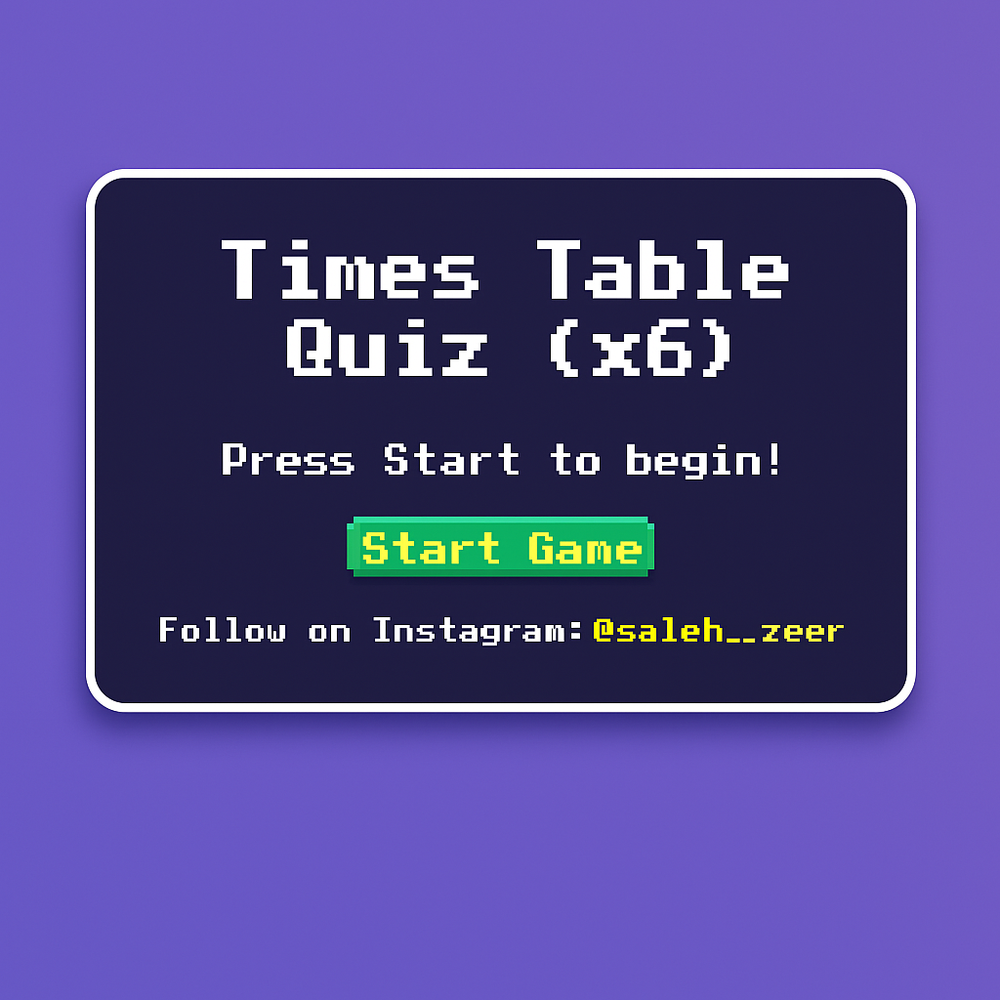

# Çarpım Tablosu Test Oyunları (x3 - x14)

## İlgi Çekici Araçlarla Öğrenmeyi Geliştirme

Eğitimciler olarak, sürekli olarak öğrencilerin dikkatini çekecek ve etkili öğrenme ortamları geliştirecek yenilikçi stratejiler ararız. Bazı temel öğrenme görevleri ustalık için tekrarlayan pratik gerektirse de, bunlar zaman zaman hem öğretmenler hem de öğrenciler için monoton hale gelebilir.

Eğlence ve katılım unsurlarını dahil etmek, öğrenme sürecini önemli ölçüde geliştirebilir. Eğitici oyunlar ve bilgi kartları (flashcards) gibi interaktif araçlar, öğrencilerin soyut kavramları ezberlemelerine yardımcı olmada son derece etkilidir ve potansiyel olarak sıkıcı alıştırmaları uyarıcı ve unutulmaz mücadelelere dönüştürür.

### Neden İnteraktif Araçlar Kullanmalı?

* **Katılımı Artırma:** Oyunlar, pratiği oyuna dönüştürerek öğrenci motivasyonunu artırır.
* **Akılda Tutmayı İyileştirme:** İnteraktif yöntemler, karmaşık veya soyut bilgilerin ezberlenmesine yardımcı olur.
* **Çok Yönlü Öğrenme:** Bilgi kartları, kendi hızında öğrenme için esnek, taşınabilir bir çalışma aracı sunar.
* **Dinamik Sınıf Ortamı:** Bu yaklaşımlar daha interaktif ve keyifli bir öğrenme atmosferi sağlar.

### Örnek: İnteraktif Matematik Uygulaması

Pratik bir uygulama olarak Çarpım Tablosu testlerini (quizlerini) düşünün. Bunlar, çarpım gerçeklerini interaktif olarak pratik yapmak ve ustalaşmak için mükemmel bir yol sağlar.

💡 **Çarpım Tablosu Test Oyunları (x3 - x14):** Çalışmayı ilgi çekici ve etkili hale getirin. Göz atın!

* 🎰 [3'ler Çarpım Tablosu](https://lnkd.in/d5WFitgn)
* 🎰 [4'ler Çarpım Tablosu](https://lnkd.in/dGmJpWfx)
* 🎰 [5'ler Çarpım Tablosu](https://lnkd.in/dbiGqy2Z)
* 🎰 [6'lar Çarpım Tablosu](https://lnkd.in/dMY4kBAz)
* 🎰 [7'ler Çarpım Tablosu](https://lnkd.in/dg_SNCB4)
* 🎰 [8'ler Çarpım Tablosu](https://lnkd.in/dDSuAra2)
* 🎰 [9'lar Çarpım Tablosu](https://lnkd.in/djfHsGsT)
* 🎰 [10'lar Çarpım Tablosu](https://lnkd.in/dDYWzHRg)
* 🎰 [11'ler Çarpım Tablosu](https://lnkd.in/dVfyg8ZF)
* 🎰 [12'ler Çarpım Tablosu](https://lnkd.in/dWaCUv8i)
* 🎰 [13'ler Çarpım Tablosu](https://lnkd.in/d8vgutPb)
* 🎰 [14'ler Çarpım Tablosu](https://lnkd.in/dFqYrfC6)

---

**Anahtar Kelimeler:** #MathGames #Education #Quizzes #GamesForEducation #FunLearning #LearnEnglish #EnglishLessons #LanguageLearning
